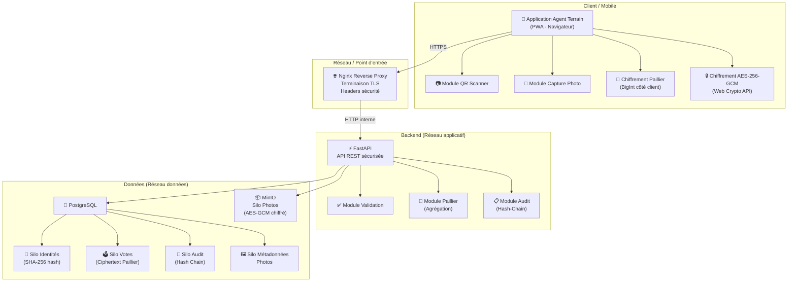
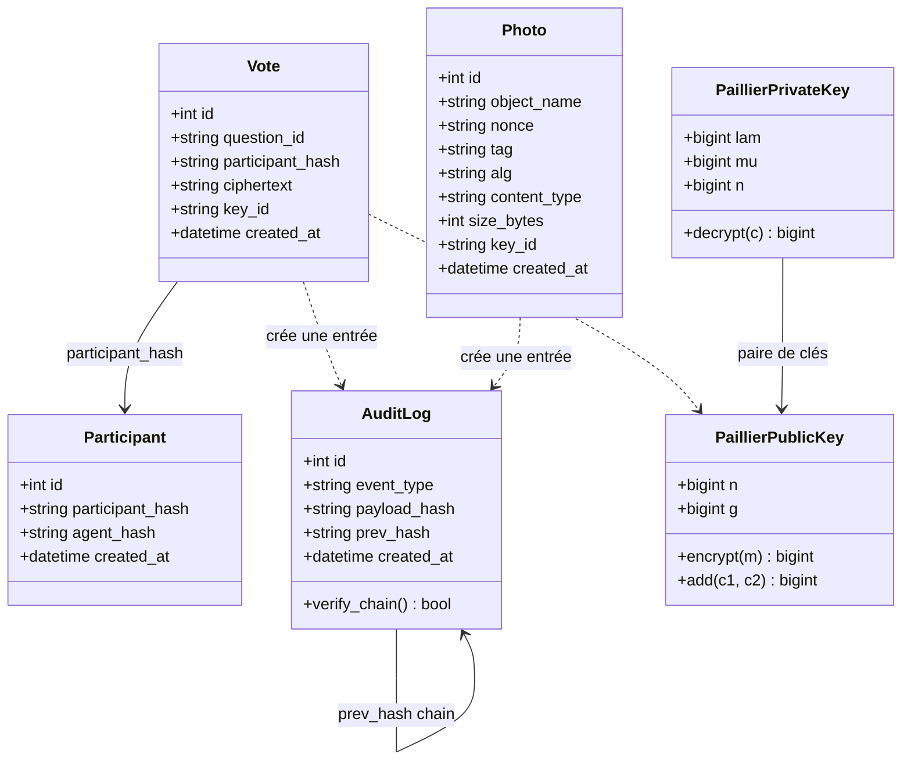
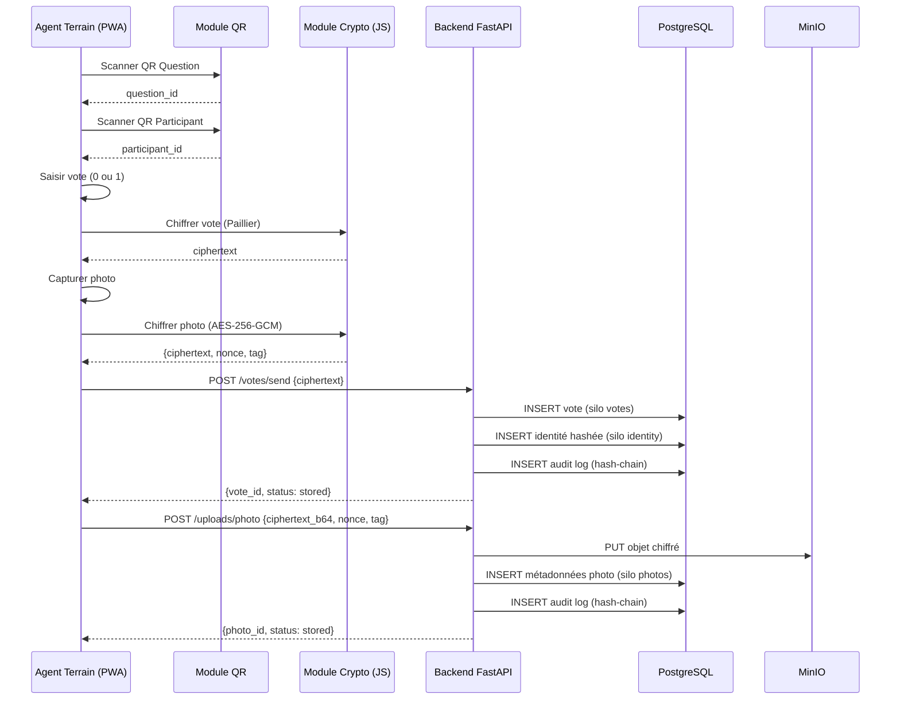
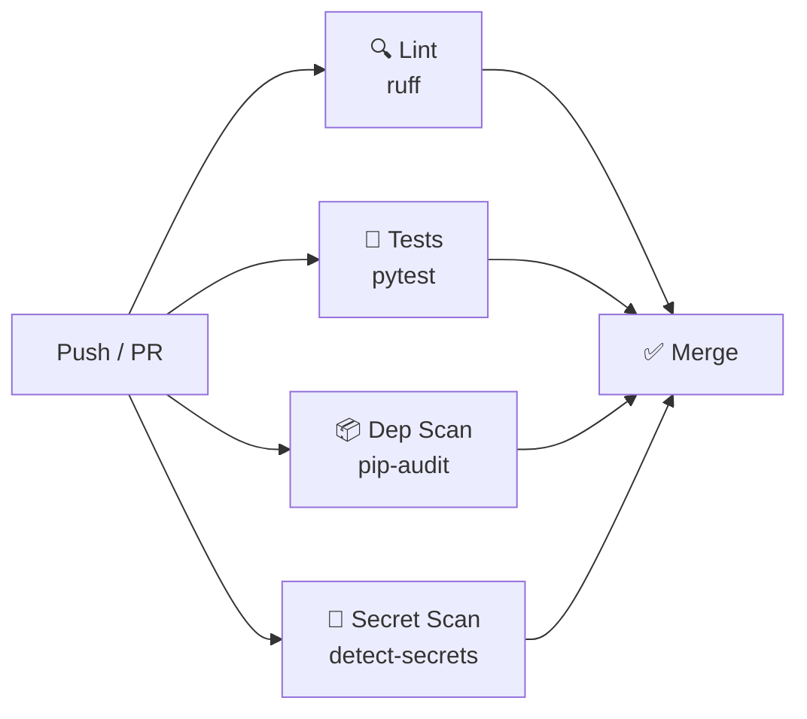

# Rapport de Conception — Système Sécurisé de Collecte et d'Agrégation Homomorphe de Votes

---

## 1. Introduction

### 1.1 Contexte

Dans le cadre d'opérations de consultation citoyenne, des agents terrain collectent des votes binaires (Oui/Non) auprès de participants identifiés. Le système doit garantir la **confidentialité** des votes individuels, l'**intégrité** des données transmises et la **traçabilité** des opérations, tout en permettant une **agrégation des résultats sans déchiffrement** des réponses individuelles.

### 1.2 Objectifs

- Collecter des réponses binaires via une application mobile sécurisée
- Identifier agents et participants par QR codes signés
- Chiffrer les votes avec un schéma homomorphe additif (Paillier)
- Chiffrer les photos avec AES-256-GCM côté client
- Stocker les données dans des silos séparés et chiffrés
- Permettre l'agrégation homomorphe sans déchiffrement individuel
- Assurer la traçabilité par journalisation immuable (hash-chain)

---

## 2. Architecture Cloud

### 2.1 Schéma d'architecture globale



### 2.2 Trois réseaux logiques

| Réseau | Rôle | Services |
|--------|------|----------|
| **Control Plane** | Coordination, monitoring, CI/CD | GitHub Actions, health checks, audit scripts |
| **Application Plane** | Flux métier, API, logique applicative | Nginx, FastAPI, modules crypto/validation |
| **Data Plane** | Stockage et accès aux données sensibles | PostgreSQL (4 silos), MinIO (photos) |

### 2.3 Justifications architecturales

**Pourquoi le chiffrement au repos est indispensable :**
Les données stockées (votes, identités, photos) contiennent des informations personnelles protégées par le RGPD. Sans chiffrement au repos, un accès non autorisé au disque ou à une sauvegarde exposerait toutes les données en clair.

**Pourquoi le chiffrement homomorphe pour les votes :**
Le chiffrement homomorphe additif (Paillier) permet de calculer la somme des votes **sans jamais déchiffrer les réponses individuelles**. Seule l'institution habilitée, détenant la clé privée, peut déchiffrer le total agrégé. Cela garantit la confidentialité absolue du vote individuel.

**Pourquoi les données sont séparées en silos :**
La séparation en 4 schémas PostgreSQL distincts (identity, votes, audit, photos) applique le **principe de séparation des responsabilités** et limite l'impact d'une compromission : un attaquant accédant au silo votes ne peut pas corréler avec les identités.

**Pourquoi un point d'entrée unique (API Gateway / Nginx) :**
Le reverse proxy Nginx centralise la terminaison TLS, l'application des headers de sécurité, et le routage. Il constitue le seul point d'entrée vers le réseau applicatif, réduisant la surface d'attaque.

**Pourquoi le backend dans un réseau isolé :**
L'isolation réseau (VPC ou équivalent Docker) empêche l'accès direct aux services internes (PostgreSQL, MinIO) depuis l'extérieur. Seul le reverse proxy est exposé publiquement.

**Protection bout en bout des flux de données :**
1. Le vote est chiffré côté client (Paillier / BigInt JS)
2. La photo est chiffrée côté client (AES-256-GCM / Web Crypto API)
3. La transmission s'effectue via HTTPS (TLS 1.3)
4. Le stockage est dans des silos séparés et chiffrés au repos
5. L'agrégation s'effectue sur les ciphertexts sans déchiffrement

---

## 3. Modèle UML

### 3.1 Diagramme de classes



### 3.2 Diagramme de séquence – Collecte d'un vote



---

## 4. Choix Technologiques

### 4.1 Application mobile

| Critère | Choix retenu : **PWA (HTML/JS)** | Alternative : Flutter |
|---------|----------------------------------|----------------------|
| Portabilité | ✅ Tous navigateurs (iOS/Android) | ✅ iOS + Android natif |
| Crypto | ✅ Web Crypto API (AES-GCM) + BigInt (Paillier) | ⚠️ Nécessite libs Dart |
| Installation | ✅ Aucune (URL) | ❌ Stores obligatoires |
| Caméra/QR | ✅ html5-qrcode (MediaDevices API) | ✅ Plugins natifs |
| Offline | ✅ localStorage + Service Workers | ✅ Hive/SQLite |

**Justification :** La PWA offre un déploiement immédiat sans store, un accès natif à la caméra et aux API cryptographiques du navigateur, et ne nécessite aucune compilation. Pour un prototype, c'est le choix le plus pragmatique.

### 4.2 Backend

| Critère | Choix retenu : **Python / FastAPI** | Alternative : Java / Spring Boot |
|---------|--------------------------------------|----------------------------------|
| Performance | ✅ Async natif (uvicorn) | ✅ Threads JVM |
| Sécurité | ✅ Validation Pydantic auto | ✅ Spring Security |
| Crypto | ✅ Bibliothèque cryptography | ✅ Bouncy Castle |
| Doc API | ✅ OpenAPI/Swagger auto | ✅ SpringDoc |
| Rapidité dev | ✅ Très rapide | ⚠️ Plus verbeux |

**Justification :** FastAPI offre une validation automatique des entrées (Pydantic), une documentation OpenAPI générée, et un écosystème Python riche en bibliothèques cryptographiques. L'async natif permet de gérer efficacement les I/O réseau et base de données.

### 4.3 Chiffrement

#### Votes — Paillier (homomorphe additif)

| Propriété | Détail |
|-----------|--------|
| Type | Homomorphe additif |
| Opération | `E(m1) × E(m2) mod n² = E(m1 + m2)` |
| Taille clé | 256 bits (démo), ≥2048 bits (production) |
| Bibliothèque | Implémentation pédagogique (Miller-Rabin) |

**Pourquoi Paillier et pas ElGamal ?** Paillier est nativement additif (multiplication des ciphertexts = addition des plaintexts), tandis qu'ElGamal additif nécessite une modification et un tableau de log discret pour le déchiffrement du total, ce qui est moins efficace pour l'agrégation de votes binaires.

#### Photos — AES-256-GCM

| Propriété | Détail |
|-----------|--------|
| Algorithme | AES-256-GCM (AEAD) |
| Nonce | 12 octets aléatoires |
| Tag d'authenticité | 16 octets (128 bits) |
| API | Web Crypto API (client), cryptography (serveur) |

**Pourquoi AES-256-GCM ?** Le mode GCM fournit à la fois le chiffrement et l'authentification (AEAD), garantissant que toute altération du ciphertext sera détectée lors du déchiffrement. C'est le standard recommandé par le NIST (SP 800-38D).

### 4.4 Base de données

| Critère | Choix retenu : **PostgreSQL** | Alternative : MongoDB |
|---------|-------------------------------|----------------------|
| Schémas | ✅ Multi-schema natif → silos | ❌ Pas de schémas |
| Chiffrement | ✅ pgcrypto + TDE possible | ⚠️ Encryption at rest |
| RBAC | ✅ Rôles granulaires natifs | ⚠️ Plus limité |
| Transactions | ✅ ACID complet | ⚠️ Eventual consistency |

### 4.5 Stockage objets

**MinIO** sélectionné comme stockage S3-compatible pour les photos chiffrées. Compatible AWS S3 API, permet le chiffrement côté serveur (SSE), et s'intègre nativement avec boto3.

### 4.6 Environnement cloud

**Docker Compose** (cloud privé local) pour le prototypage, transposable vers :
- **AWS** : ECS/Fargate + RDS + S3 + API Gateway
- **GCP** : Cloud Run + Cloud SQL + GCS + Cloud Endpoints

L'**isolation réseau** (VPC) est obligatoire car les bases de données et le stockage objet ne doivent jamais être accessibles depuis Internet. Seul le point d'entrée (Nginx/API Gateway) doit avoir une adresse publique.

---

## 5. Conception Cryptographique

### 5.1 Chiffrement homomorphe — Flux détaillé

```
Vote client (m ∈ {0,1})
    │
    ▼
    E(m) = g^m · r^n mod n²    ←── chiffrement Paillier (clé publique)
    │
    ▼
    Transmission HTTPS → Backend
    │
    ▼
    Stockage : ciphertext dans silo "votes"
    │
    ▼
    Agrégation : ∏ E(mi) mod n² = E(∑ mi)
    │
    ▼
    Déchiffrement (clé privée institution) → total votes "Oui"
```

### 5.2 Propriétés garanties

| Propriété | Mécanisme |
|-----------|-----------|
| **Confidentialité vote** | Chiffrement Paillier (jamais déchiffré individuellement) |
| **Confidentialité photo** | AES-256-GCM côté client (nonce aléatoire) |
| **Intégrité données** | Hash chain audit (SHA-256, prev_hash) |
| **Intégrité photos** | Tag GCM 128 bits (authentification AEAD) |
| **Anonymat participant** | Hashage SHA-256 des identifiants |
| **Non-corrélation** | Silos séparés (identité ≠ votes ≠ photos) |
| **Non-répudiation** | Audit log avec agent_id + timestamp |

---

## 6. Sécurité

### 6.1 Headers HTTP

| Header | Valeur | Protection |
|--------|--------|------------|
| `Strict-Transport-Security` | `max-age=63072000` | Force HTTPS |
| `X-Content-Type-Options` | `nosniff` | Empêche MIME sniffing |
| `X-Frame-Options` | `DENY` | Empêche clickjacking |
| `X-XSS-Protection` | `1; mode=block` | Protection XSS |
| `Referrer-Policy` | `strict-origin` | Limite le Referer |
| `Cache-Control` | `no-store` | Pas de cache sensible |

### 6.2 IAM — Moindre privilège

```sql
-- Rôle app_user : non-superuser, pas de création DB/rôles
CREATE ROLE app_user LOGIN PASSWORD '...'
    NOSUPERUSER NOCREATEDB NOCREATEROLE NOINHERIT;

-- Permissions limitées par schéma
GRANT SELECT, INSERT ON ALL TABLES IN SCHEMA votes TO app_user;
GRANT SELECT, INSERT ON ALL TABLES IN SCHEMA identity TO app_user;
-- Pas de DELETE, UPDATE, DROP
```

### 6.3 CORS

```python
allow_origins=["http://localhost:3000"]  # Frontend uniquement
allow_methods=["GET", "POST"]            # Pas de PUT/DELETE
allow_credentials=False                   # Pas de cookies cross-origin
```

---

## 7. Plan de Tests

### 7.1 Tests unitaires

| Module | Tests | Couverture |
|--------|-------|------------|
| Paillier | encrypt/decrypt round-trip, addition homomorphe, add_plain | Cryptographie |
| DB models | Insertion/lecture silos séparés, hashage identifiants | Intégrité données |
| Hash chain | Chaîne valide, détection corruption | Audit |

### 7.2 Tests d'intégration (API)

| Endpoint | Tests | Vérification |
|----------|-------|-------------|
| `/health` | Réponse 200, DB OK | Disponibilité |
| `/votes/send` | Stockage ciphertext, audit log créé | Flux métier |
| `/votes/aggregate` | Somme homomorphe correcte, cas vide | Agrégation |
| `/uploads/photo` | Upload MinIO, métadonnées DB | Photos |
| `/iam/verify` | Rôle non-privilegié, grants OK | Sécurité |

### 7.3 Tests d'audit automatisés

5 scripts vérifiant la conformité continue : votes chiffrés, photos chiffrées, IAM moindre privilège, hash-chain intégrité, ports réseau.

---

## 8. CI/CD

### Pipeline GitHub Actions



Les 4 jobs s'exécutent en parallèle. Le merge n'est autorisé que si tous passent.

---

## 9. Conformité

| Exigence | Implémentation |
|----------|---------------|
| **RGPD** | Chiffrement bout-en-bout, hashage identités, silos séparés |
| **ISO 27001** | IAM moindre privilège, audit immuable, gestion des accès |
| **Confidentialité** | Paillier (votes), AES-GCM (photos), TLS (transit) |
| **Intégrité** | Hash chain, tags GCM, validation Pydantic |
| **Disponibilité** | Mode offline PWA, health checks, Docker restart |
| **Non-répudiation** | Audit logs avec agent_id + timestamp |
